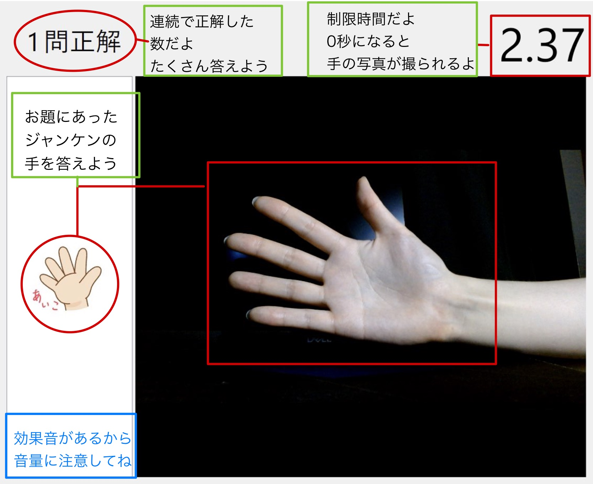

 # じゃん検定
 
 ### ジェスチャー判別AIを使ったC++による、じゃんけんゲーム
 
環境
visual studio 2019;
Qt Widgets (ver6.5);
pytorch for c++ (libtorch);
Opencv for c++;
Cuda 11.3;

-----------------------------
### ゲームプレイ画像

ディレクトリのmovie.mp4がプレイ動画
 

---------------------------

### Game_for_github 

サイズが大きいため、抜粋したコードのみ

インポートライブラリなどはテキスト情報のみ

-------------------------------

### Gesture_Model

ゲームプレイ用のAIモデルを作るためのコード

実際はMnistのファインチューニングを行ったモデルで

グー、チョキ、パーの判別を行う

HandGesture_module_v2 > モデルづくり用のモジュールセット

mnist_finetuning > mnistのファインチューニングモデル用のモデル作成 (作成モデルはフォルダーmnist_modelの中)

learn_model      > mnistのモデルを使って手のモデル作り (作成モデルはフォルダーmodelの中)
